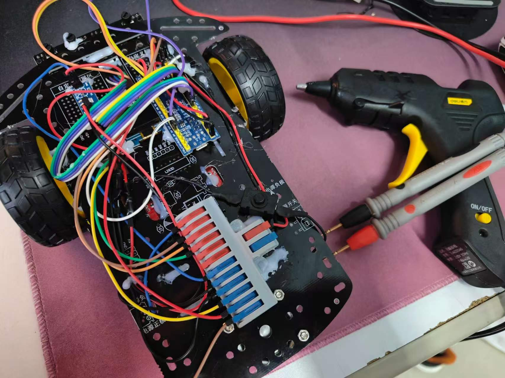
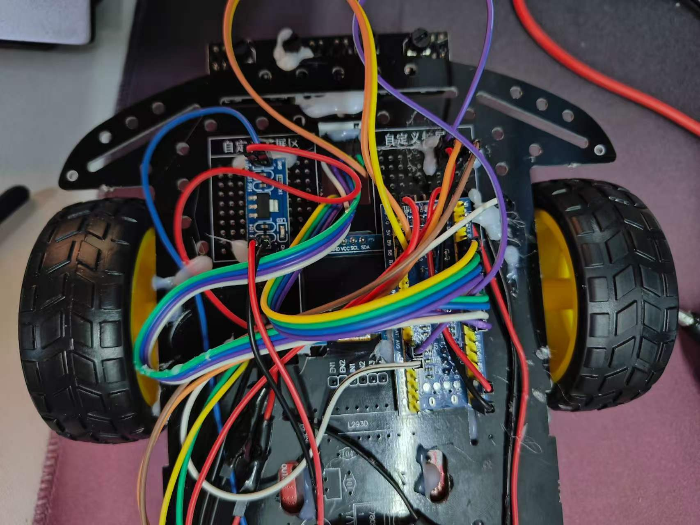
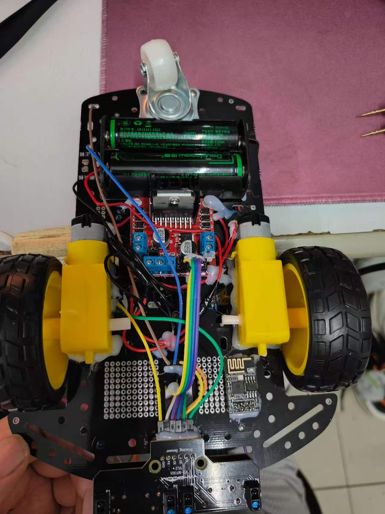

# 基于STM32的隐私保护无人配送原型系统

## 项目简介
当前外卖配送流程中，用户必须填写精确到门牌号的地址，骑手在配送全程都能看到这些信息。对于独居女性、隐私敏感人群来说，这构成了实实在在的安全隐患。本项目的终极目标，是实现 "信息与实体隔离" 的隐私配送方案

## 实物展示

  
  
图1：无人车整体外观

  
  
图2：主控板及外设接线细节（俯视图）

  
  
图3：底盘供电系统与电机驱动布局（底部图）

## 开发工具
硬件清单：STM32F103C8T6、ESP8266、L298N、18650电池等。
开发环境：Keil MDK、C语言。

## 硬件接线表

| 模块 | 引脚 | STM32引脚 | 说明 |
| :--- | :---: | :---: | :--- |
| ESP8266 | TX | PA10 (RX) | 串口1接收 |
| ESP8266 | RX | PA9 (TX) | 串口1发送 |
| L298N | IN1 | PA0 | 电机A方向控制 |
| L298N | IN2 | PA1 | 电机A方向控制 |
| L298N | IN3 | PA2 | 电机B方向控制 |
| L298N | IN4 | PA3 | 电机B方向控制 |
| 灰度传感器 | OUT1 | PA4 | 循迹通道1 |
| 灰度传感器 | OUT2 | PA5 | 循迹通道2 |
| 灰度传感器 | OUT3 | PA7 | 循迹通道3 |
| 灰度传感器 | OUT4 | PA6 | 循迹通道4 |
| OLED | SCL | PB8 | I2C时钟线 |
| OLED | SDA | PB9 | I2C数据线 |

## 文件功能说明

| 文件       | 功能 | 核心内容 |
| --- | --- | --- |
| `main.c` | 主逻辑 | 初始化、指令解析、模式切换 |
| `Motor.c/h` | 电机驱动 | GPIO控制、正反转、差速转弯 |
| `WIFI.c/h` | WiFi通信 | AT指令封装、串口中断接收、缓冲区管理 |
| `OLED.c/h` | 显示驱动 | I2C通信、字符串显示 |
| `Sensor.c/h` | 循迹传感 | GPIO读取、状态组合、自动循迹逻辑 |
| `Delay.c/h` | 延时函数 | 毫秒级延时 |

## 核心功能实现

1. **通信设计**：基于ESP8266搭建TCP服务器，通过UART中断+环形缓冲区接收数据，设计 `+IPD` 前缀解析算法解决串口数据时序问题。
2. **寻迹算法**：实现4路灰度传感器直线巡线及路口检测。
3. **状态显示**：集成OLED实时显示WiFi连接状态及配送进度。

## 后续优化方案设计

| 模块 | 方案 |
| --- | --- |
| 二维码扫描 | 终端集成扫码模块，或使用手机扫码后通过局域网发送 |
| 地址解析 | 二维码包含加密的地址信息，终端解密后获得目标位置 |
| 路径规划 | 预设多条路线，根据目标地址自动匹配 |
| 多车调度 | 如果小区较大，需要多台小车协同，用 MQTT 做任务队列 |
| 电梯联动 | 与电梯厂商合作，实现小车自主乘坐电梯（长期目标） |

## 可能的落地场景

1. **高端封闭社区**：物业采购系统作为增值服务，业主自愿开通；物业费中收取少量隐私配送服务费；楼宇智能化基础好，电梯可联动。
2. **科技园区/写字楼**：园区统一管理，配送需求集中；可与园区门禁系统打通，实现“无接触配送”。
3. **酒店/公寓**：已有送餐机器人基础，可升级为隐私配送模式；与酒店 PMS 系统对接，自动分配房间号。

